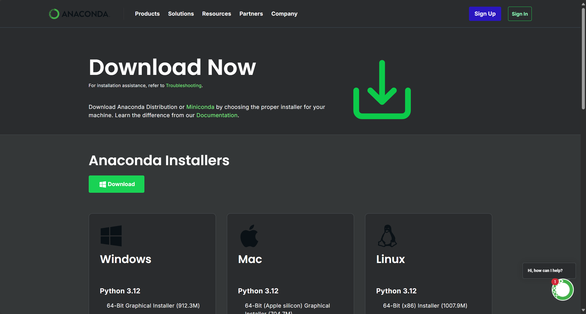
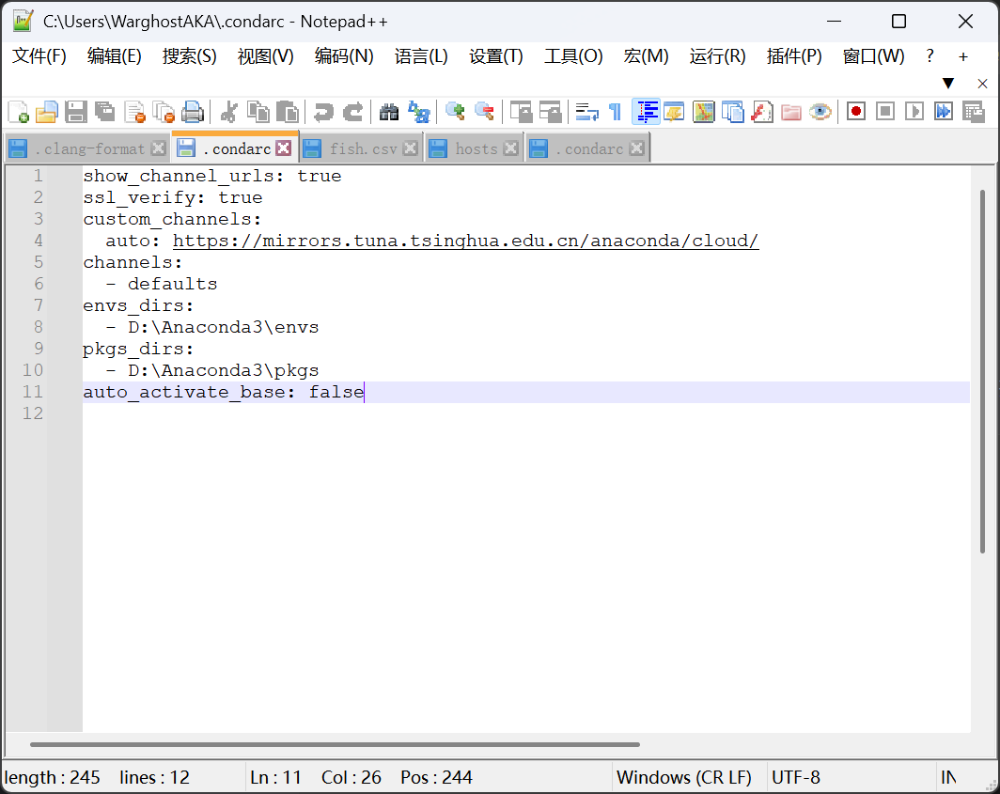
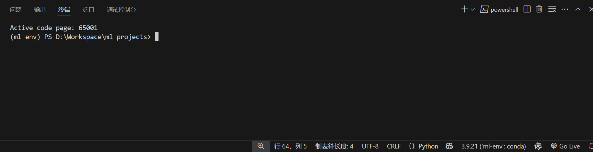

# Conda+vscode配置

2025年3月20日19:04:44 今天早上重新配置了conda，原因是在vscode中选择了conda的虚拟环境中的解释器，但是实际在powershell终端中仍然使用的是全局配置的编译器，加上之前也发现powershell中虚拟环境的命令会出现一些问题，包括报错配置文件中存在非法字符等

重新配置的时候也出现了一些新的问题，因此在此记录

---

## 下载Anaconda

下载地址[Download Anaconda Distribution | Anaconda](https://www.anaconda.com/download/)



下载之后可以搜索到 Anaconda Prompt 和 Anaconda Navigator

如果下载的是新版的Anaconda3 可以直接弹出 Anaconda Navigator，如果使用旧版则会出现循环打不开的问题，解决问题的文章找不到了

在 Anaconda Prompt 中输入验证命令：

```bash
conda -V
```

---

## 配置虚拟环境下载位置

默认会下载到 `C:\Users\WarghostAKA\.conda\envs`

通过修改配置文件实现虚拟环境位置的修改 

在`C:\Users\WarghostAKA\.condarc`添加内容：

```yaml
envs_dirs:
  - D:\Anaconda3\envs
pkgs_dirs:
  - D:\Anaconda3\pkgs
```

这样虚拟环境就能修改到D盘里了

---

## 使用命令配置conda虚拟环境

使用Anaconda Prompt 相关命令来创建conda虚拟环境，这里以我 ml-env 的虚拟环境为例

```shell
conda create -n ml-env python=3.9
```

然后激活并切换到这个虚拟环境

```shell
conda activate ml-env
```

使用 conda install 命令下载需要的软件包

```shell
conda install numpy pandas scikit-learn matplotlib scipy
```

使用 conda install 命令安装 torch（CPU）

```shell
conda install pytorch torchvision torchaudio cpuonly -c pytorch
```

可以使用命令来退出虚拟环境

```shell
conda deactivate
```

如果下载出现问题可以删除环境

```shell
conda env remove --name ml-env
```

因为虚拟环境构建的时候会下载pip 也可以使用 pip 来下载需要用的包，可以使用镜像（我在试图配置conda镜像后出现无法连接到指定计算机问题，目前还没能得到解决）

以 pyqt5 下载为例（conda 中部分包名和pip下载时不一样，例如conda install 没有 pyqt-tools 包，还有就是下载pyqt5时需要指定版本5.15，不然默认下载pyqt6）

```shell
pip install PyQt5 pyqt-tools -i https://pypi.tuna.tsinghua.edu.cn/simple/
```

---

## 更改powershell的安全策略

这里参考文章[解决Win10 PowerShell无法激活Anaconda环境的问题 - Dereen - 博客园](https://www.cnblogs.com/dereen/p/ps_conda_env.html)

这里前提**必须将Anaconda 写入环境变量**。否则在PowerShell 输入conda 的任何命令都会无法识别

将路径添加到环境变量：`C:\Users\user\Anaconda3\condabin`

修改powershell的安全策略，在powershell管理员模式下输入

```shell
Set-ExecutionPolicy -ExecutionPolicy RemoteSigned
```

这里可能会显示：

> Set-ExecutionPolicy : Windows PowerShell 已成功更新你的执行策略，但在更具体的作业域中定义的策略覆盖了该设置。由于发生覆盖，你的外壳程序将保留其当前的有效执行策略 Bypass

输入命令查看当前执行策略

```shell
Get-ExecutionPolicy -List
```

发现CurrentUser 的执行策略为 Bypass，使用修改为RemoteSigned

```shell
Set-ExecutionPolicy -ExecutionPolicy RemoteSigned -Scope CurrentUser
```

在`PoweShell`管理员模式下输入以下命令，安装`PSCondaEnvs`包:

```shell
conda init powershell
```

上述操作完成后，每次打开`PowerShell`都会自动切换到`base`环境下，若想关闭可使用以下命令：

```shell
# 关闭
conda config --set auto_activate_base false
# 开启
conda config --set auto_activate_base true
```

配置文件中会显示该配置



此时在vscode中能够根据所选择的解释器，终端powershell会自动切换到 对应的虚拟环境下

