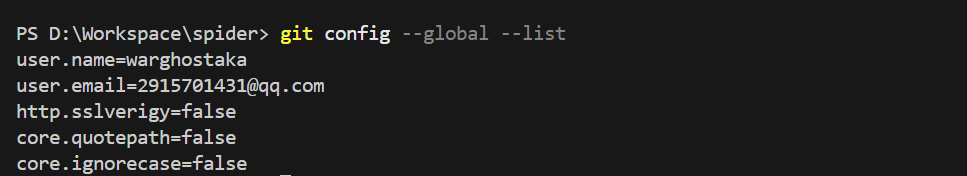
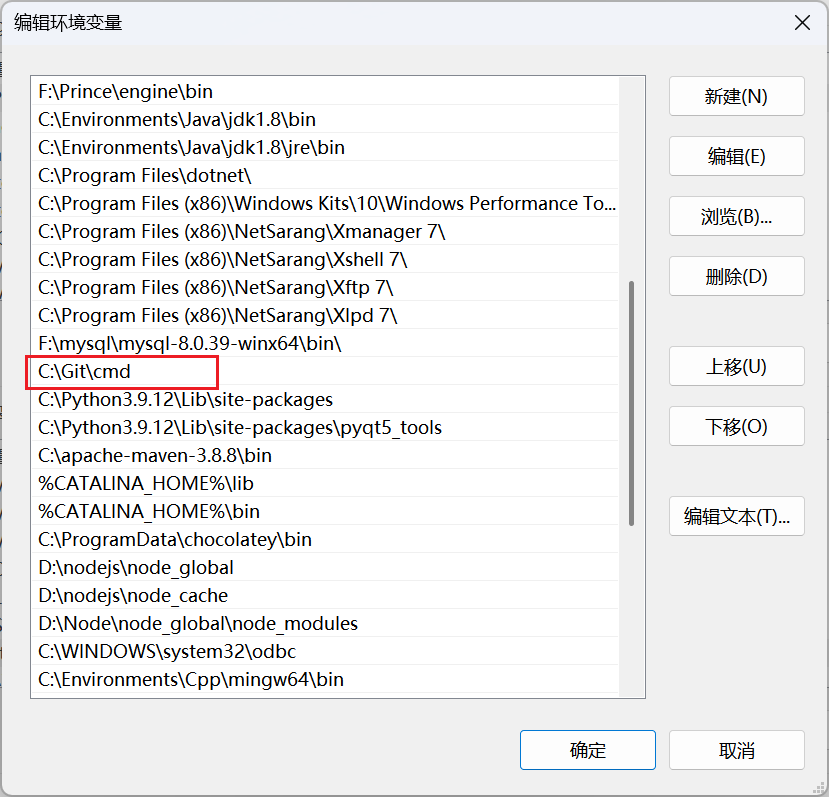
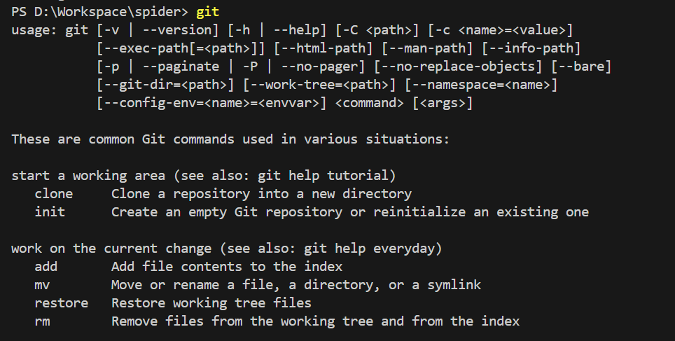
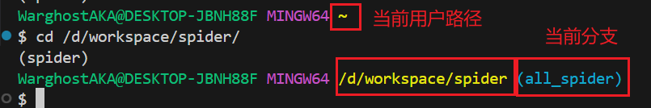
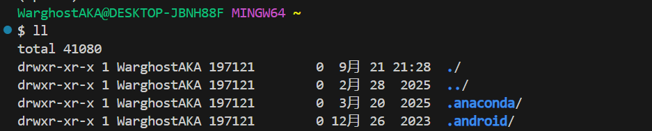
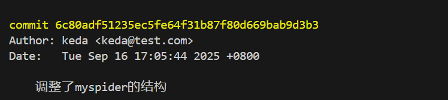

# git基本配置

## git基本配置

安装完 git 之后，使用命令检查

```bash
git --version
```

安装完成后进入需要配置 **用户名** 和 **邮箱地址** ，之后这些信息每一次都会被写入到提交中，而且不可更改

```bash
git config --global user.name "warghostaka"
git config --gloabl user.email 2915701431@qq.com
```

> `--global`是全局配置参数，只需要配置一次
>
> 使用的邮箱可以不存在，用户名和邮箱仅是用来确认提交人的身份，git首次安装需要配置该信息否则无法提交代码

使用命令查看当前git的配置

```bash
git config --global --list
```



用户名的提交效果，keda和warghost是我的两台电脑


---

## git环境变量配置

进入系统path，在path中添加git地址



此时直接在cmd中输入git会出现以下内容



> 这里可以看到，除了git的常用命令，还包含一些基本的linux命令，例如`touch`等，实际上git bash相当于移植了linux系统中的一些基本命令，这里也可以看到windows路径在bash中的写法：
> 

---

## git为常用命令设置别名

有些常用指令参数非常多，因此可以使用别名，方法是在`~`创建和修改 `.bashrc` 文件

以linux的`ll`命令为例

```bash
# 用于输出git提交日志
alias git-log='git log --pretty=oneline --all --graph --abbrev--commit'
# 用于输出当前目录所有文件的详细信息
alias ll='ls -al'
```

然后执行

```bash
source ~/.bashrc
```

使用效果



---

## 解决git bash中的中文乱码问题

执行命令，设置全局编码为UTF-8

```bash
git config --global core.quotepath false
git config --global i18n.commitEncoding utf-8
git config --global i18n.logOutputEncoding utf-8
```

然后修改 `${git_home}/etc/bash.bashrc`，增加内容

```bash
# 解决中文字符乱码问题
export LANG="zh_CN.UTF-8"
export LC_ALL="zh_CN.UTF-8"
```



在PowerShell中查看当前输出编码的变量

```powershell
[Console]::OutputEncoding = [System.Text.Encoding]::UTF8
```

> **`[Console]`**
>
> - 这是 .NET 的 `System.Console` 类，PowerShell 可以直接调用。
> - 它控制当前控制台的输入输出行为。
>
> **`OutputEncoding`**
>
> - 这是 `System.Console` 的一个静态属性，表示 **控制台输出的编码方式**。
> - 默认情况下，Windows 控制台使用系统代码页（例如简体中文是 **GBK / CP936**）。
> - 这就导致当 Git 输出 UTF-8 编码的中文时，控制台按 GBK 去解读，结果乱码。
>
> **`[System.Text.Encoding]::UTF8`**
>
> - 这是 .NET 框架里表示 UTF-8 编码的对象。
>
> **整体作用**
>
> - 把 PowerShell 的 **控制台输出编码** 改为 **UTF-8**。
> - 这样，当 Git（或其他程序）输出 UTF-8 内容时，PowerShell 会正确解码并显示中文。
