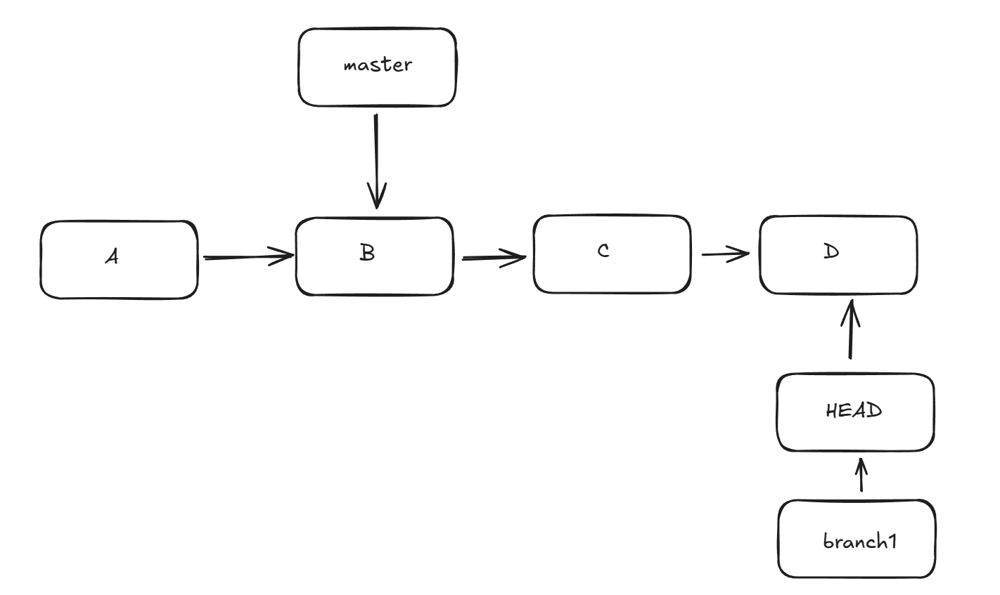
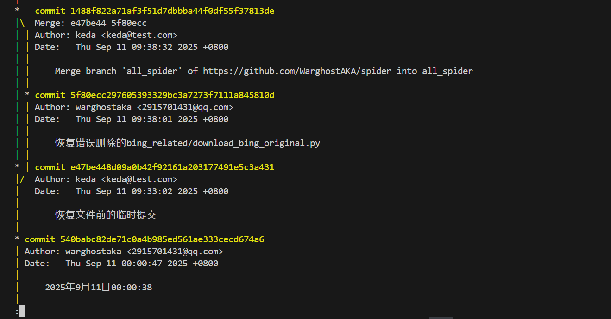
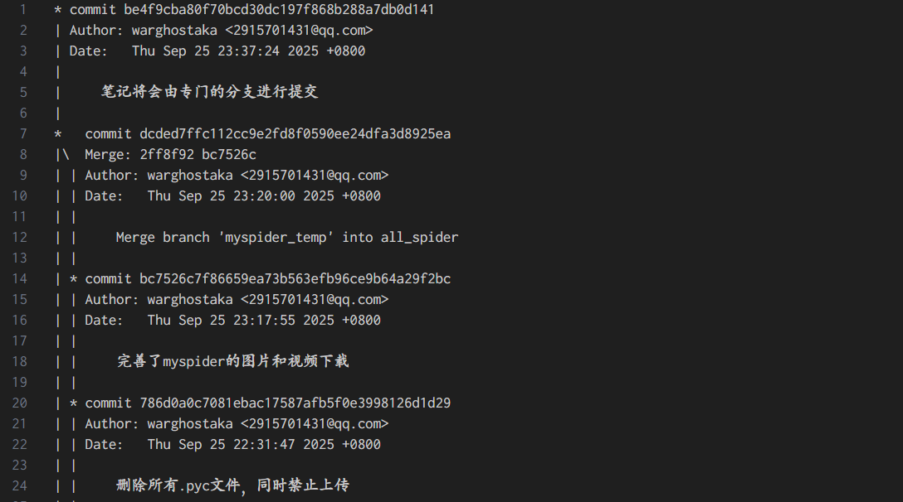
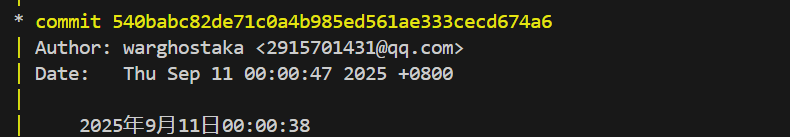

# 一些使用git时遇到的问题以及解决方案

这个笔记用于记录一些遇到的问题，涉及一些场景和git命令

## 合并 变基与HEAD

参考文章：

[Git：合并分支----git merge命令应用的三种情景-CSDN博客](https://blog.csdn.net/qq_42780289/article/details/97945300)

[Git整合分支的两种方法——合并(git merge)与变基(git rebase)的区别_变基和合并的区别-CSDN博客](https://blog.csdn.net/wpw2000/article/details/115890784)

**HEAD的本质是一个指针**，它指向当前分支的最新提交，也就是当前工作区的基准提交



---

## 使用git log查看提交记录

```bash
git log
```

这个命令可以查看当前分支下的提交历史，从当前HEAD一直往回追溯，可以配置参数查看指定分支的提交

```bash
# 查看所有分支的提交记录
git log -all
# 查看特定分支的提交
git log branch1
```

一些常用的参数

```bash
# 以图形化显示提交
git log --graph
# 以间接的一行提交信息
git log --oneline
# 筛选指定提交人
git log --author=<作者>
```

使用`q`用来退出，使用 **空格** 切换到下一页



此外，还能直接把内容导入到文件中进行查看，此时会自动创建对应文件

```shell
git log --graph branch -- > branch.txt
```

> git 需要区分分支名和文件名，之间用 `--` 进行分隔



可以根据日期筛选提交

```shell
# 只显示某个日期后的提交
git log --since="2025-09-24"
# 查看某个日期之前的提交
git log --until="2025-09-25"
# 查看某个日期范围内的提交
git log --since="2025-09-24" --until="2025-09-25"
```

## git无关仓库无法合并问题

重构工作区代码时删除了本地仓库，试图重新初始化仓库并与远程仓库合并，因此出现以下错误

```bash
`\> git pull --tags origin main From https://github.com/WarghostAKA/Training * branch            main       -> FETCH_HEAD 
fatal: refusing to merge unrelated histories
```

出现原因：在 git 中创建的本地仓库和远程仓库都会保存所有的提交记录，而 git 机制不允许合并两个完全没有 **共同祖先提交** 的目录，因此当使用命令：

```bash
# 命令含义：从 origin 远程仓库中 拉取分支main，然后合并到当前所在的本地分支
git pull origin main
```

git 发现当前本地仓库没有共同的祖先提交，因此认为远程仓库和本地仓库是2个仓库，无法拉取

触发场景是删除了本地仓库，重新初始化新仓库的情况下，试图使用 pull 命令将远程仓库 origin 中 main 分支的代码直接用作替换当前目录里的代码

对应的解决方法如下：

- 一般来说，如果本地没有需要提交的文件，直接删除目录，然后通过 clone 命令重新将完整的远程仓库克隆到本地仓库

```bash
git clone https://github.com/WarghostAKA/spider.git
```

- 如果有需要提交的文件也可以直接初始化仓库，然后用命令完成关联和抓取最新的分支记录

```bash
git init
git remote add origin https://github.com/WarghostAKA/spider.git
git fetch origin
git add .
git commit -m "test"
# 通过提交命令关联远程分支，此后可以直接用 git push 推送
git push -u origin main
```

---

## 修正上一次提交

2种情况，已推送和未推送

未推送的情况下，可以修改将工作区新的改动合并到上一次的提交中

```bash
# 新的修改
git add .
git commit --amend
```

只修改提交信息

```bash
git commit --amend -m "修改后的提交信息"
```

已经推送的情况下，需要重写历史

> 如果已经有人拉取过你的提交，这种操作可能会产生冲突

首先修改本地提交，然后强制推送到远程仓库，强制推送会覆盖远程历史

```bash
git commit --amend
git push --force
```

---

## 使用哈希值退回到某一次提交

如果将代码回退到某个版本，可以利用提交的哈希值进行退回操作



从提交记录可以看出，每一个 **提交对象** 都会存在一个 **SHA-1哈希值**
哈希值40位，通常前7位足够识别，他代表一次完整的提交，是提交的快照和信息的结合

使用这个哈希值可以临时回退，也可以修改历史

使用命令可以临时回退，查看旧版本的代码

```bash
git checkout 540babc
```

此时HEAD被称为游离状态，用命令可以返回原来分支

```bash
git checkout main
```

使用命令回退到某个提交

```bash
git reset --hard 540babc
```

这种方式会把分支重置到该提交，会导致之后的所有提交都消失

如果只是想撤销提交，但保留改动，可以用`--soft`，此时代码保留在暂存区

```bash
git reset --soft 540babc
```

保留历史，并且从某个分支开始进行代码修改，最好的方式是在该提交上创建分支，这样会新建一个分支，而不会影响原分支

```bash
git checkout -b branch 540babc
```

---

### 关于哈希值和提交对象的存储

事实上，每次提交都会产生一个**提交对象 commit object**，git用一个**内容寻址的哈希值**来标识这个唯一对象

这个哈希值是确定的值，它基于提交对象的内容计算得到，因此任何改动，包括：父提交，树，提交时间和信息都会完全改变哈希值，这也导致了提交对象一旦生成就是**不可变**的（因为它的哈希固定指向其内容）

### 分支原理

分支名不是对象本身，只是一个**指向提交哈希的指针**，存在于 `.git/refs/heads/<branch>`（或 `.git/packed-refs` 中）。

`HEAD` 文件通常包含 `ref: refs/heads/main` 之类的内容（表示当前分支），或者在 detached HEAD （游离）时直接包含一个 commit hash。

提交之间通过 `parent <hash>` 字段串成 DAG（有向无环图）——这就是 Git 的提交历史图

---

## 从某一次提交中恢复指定文件或目录

在一次新的提交中，错误的删除了一个重要文件，可以从某次提交中恢复单个文件或目录

先查看日志查询特定提交的哈希值前7位，并查看指定提交的内容


```shell
git show 4490b62 -- > log
```

从一个特定的提交中返回这个文件或者目录

```bash
git checkout 540babc -- path
```

执行后会放到当前工作区或者暂存区

如果不想add，可以直接用命令

```bash
git show 540babc:path > new_path
```

不过这种方法返回的文件不会保留原本的目录结构，而是单一文件或者目录直接返回到当前工作区的根目录下

---

## 本地分支和远程分支的删除

通过命令删除本地分支

```shell
# 分支已被合并，普通删除本地分支
git branch -d branch
# 分支未合并，强制删除本地分支
git branch -D branch
```

> 删除前需要切换到其他分支

存在这样一个问题，本地分支在合并删除后，远程分支不会被自动删除

通过命令清理远程分支

```shell
git push origin --delete branch
```

---

## 创建清除提交记录的孤儿分支

现在想把笔记单独放在一个分支里，并希望这个新分支不包含之前代码的提交记录，可以通过创建孤儿分支解决这个问题

```shell
# 创建孤儿分支
git checkout --orphan notes
# 将当前工作区的文件作为初始提交
git add .
git commit -m "初始提交"
```

如果已经有了一个包含提交的新分支，可以用孤儿分支替代这个分支

```shell
git branch -M notes_clean notes
```

> `-M` 是 `--move --force` 的简写，相当于重命名分支，覆盖掉原来的 `notes`

---

## 拉取远程创建的新分支

由于 `pull` 只作用于当前分支而无法拉取远程新分支，可以使用 `fetch` 来实现远程分支拉取到本地

```shell
# 把远程所有分支信息拉取到本地
git fetch origin
# 查看远程分支
git branch -r
```

此时不会自动在本地生成一个同名的工作分支，还需要签出这个新分支，并跟踪远程

```shell
git checkout -b notes origin/notes
```

