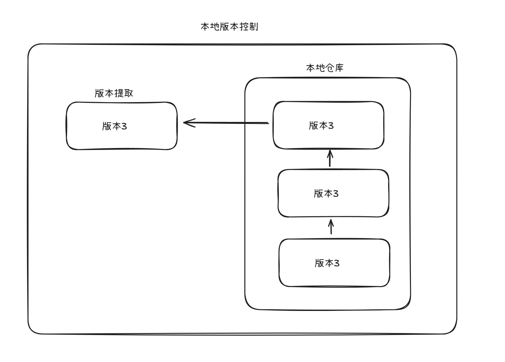
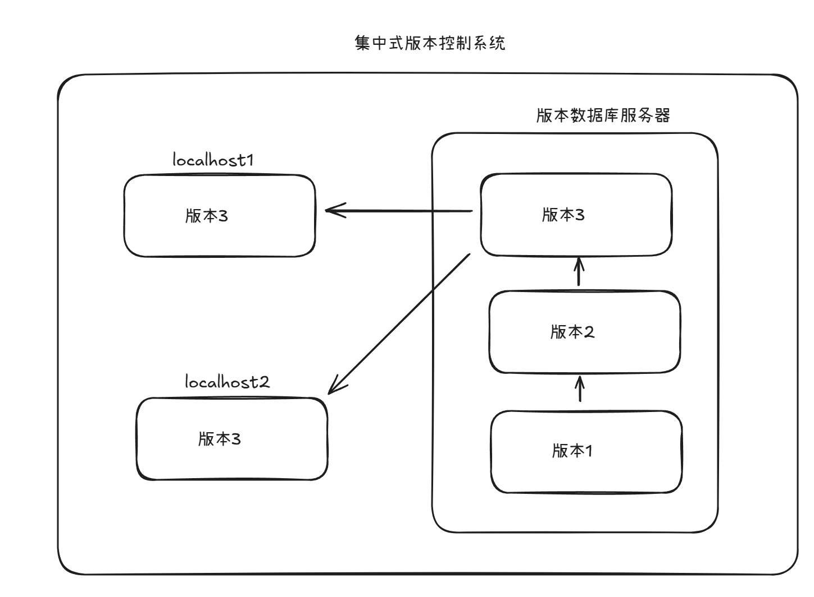
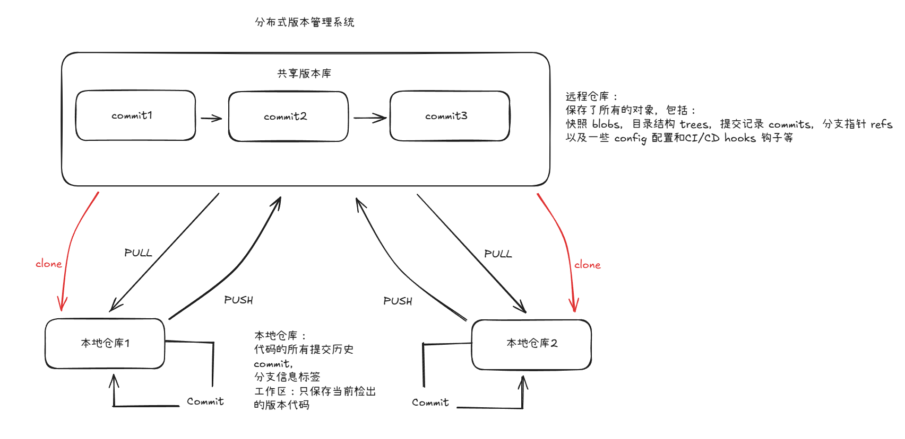
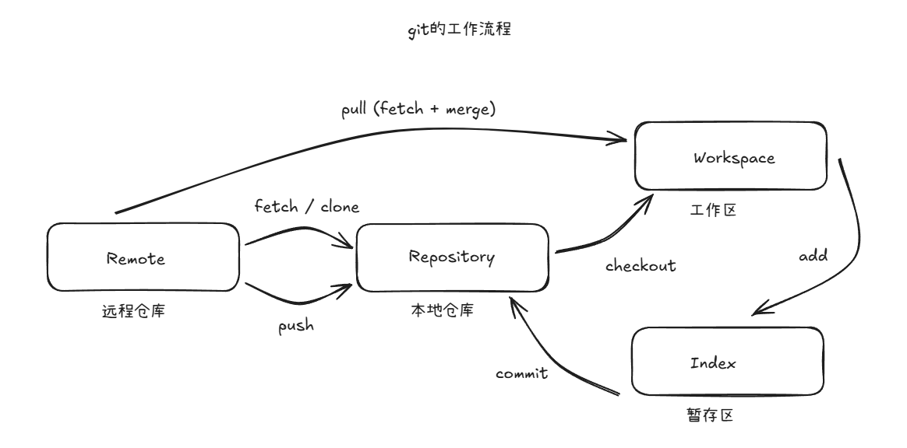

# 版本控制与git的工作流程

## 版本控制系统

### 1. 本地版本控制系统

采用本地简单数据库记录历次更新差异

### 2. 集中化版本控制系统

能够实现多位开发者协同工作，通过单一管理的服务器保存所有的修订版本，通过客户端连接和提交更新

包括：SUBVERSION , PERFORCE 等，SVN 和微软推出了 CVS

问题在与服务器的单点故障，如果中心数据库硬盘损毁，会导致更新历史记录的损坏

### 3.分布式版本管理系统

客户端不止提供下载最新版本的服务，而是提供完整的仓库镜像下载，包括历史记录，因此每次下载的镜像本质都是代码仓库的完整备份

- **本地仓库包含：**
	1. 代码的所有提交历史（每一个 commit，也就是你理解的“版本”）。
	2. 分支信息、标签等。
	3. 对象数据库（blobs、trees、commits）——用来高效存储版本变化。
- **工作区（Working Directory）** 只保存你当前检出的那一个版本的文件。
- **本地仓库（Local Repository）** 的 `.git` 目录里保存了所有的历史和版本信息。

所以，当你从远程仓库 `clone` 下来时，本地的 `.git` 目录里就已经有了完整的版本历史，你可以在本地执行 `git log`、`git checkout`、`git diff` 等操作，而不需要访问远程。

git 是分布式版本管理系统，使用场景为：备份，代码还原，协同开发，追溯代码编写人员和编写时间

包括：git darcs等

---

## git的工作流程

包括如下命令：

- **clone （克隆）：** 从远程仓库克隆代码到本地仓库
- **checkout （检出）：** 从本地仓库检出一个仓库然后进行修订
- **add （添加）：** 在提交前将代码提交到暂存区
- **commit （提交）：** 提交到本地仓库，本地仓库中保存修改的各个版本历史
- **fetch （抓取）：** 从远程仓库抓取到本地仓库，不进行任何的合并操作，一般不使用
- **pull（拉取）：** 从远程库拉到本地库，自动进行合并**（merge）**，然后放到工作区，相当于 **fetch + merge**
- **push （推送）：** 修改完成后，需要和团队共享代码时，推送代码到远程仓库