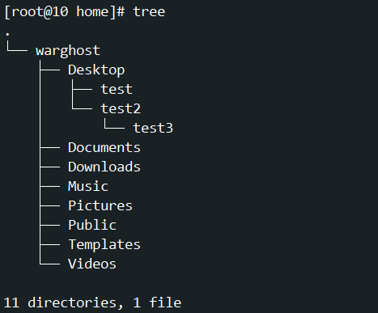

# CentOS7下配置yum源的问题

*参考文章*：[tree命令的安装（最新！！！成功解决！！！）_centos安装tree-CSDN博客](https://blog.csdn.net/2401_83418369/article/details/143013354)

当我尝试下载tree时，使用命令

```bash
yum install tree
```

发生如下报错：

```bash
Loaded plugins: fastestmirror, langpacks
Loading mirror speeds from cached hostfile
Could not retrieve mirrorlist http://mirrorlist.centos.org/?release=7&arch=x86_64&repo=os&infra=stock error was
14: curl#6 - "Could not resolve host: mirrorlist.centos.org; Unknown error"


 One of the configured repositories failed (Unknown),
 and yum doesn't have enough cached data to continue. At this point the only
 safe thing yum can do is fail. There are a few ways to work "fix" this:

     1. Contact the upstream for the repository and get them to fix the problem.
    
     2. Reconfigure the baseurl/etc. for the repository, to point to a working
        upstream. This is most often useful if you are using a newer
        distribution release than is supported by the repository (and the
        packages for the previous distribution release still work).
    
     3. Run the command with the repository temporarily disabled
            yum --disablerepo=<repoid> ...
    
     4. Disable the repository permanently, so yum won't use it by default. Yum
        will then just ignore the repository until you permanently enable it
        again or use --enablerepo for temporary usage:
    
            yum-config-manager --disable <repoid>
        or
            subscription-manager repos --disable=<repoid>
    
     5. Configure the failing repository to be skipped, if it is unavailable.
        Note that yum will try to contact the repo. when it runs most commands,
        so will have to try and fail each time (and thus. yum will be be much
        slower). If it is a very temporary problem though, this is often a nice
        compromise:
    
            yum-config-manager --save --setopt=<repoid>.skip_if_unavailable=true

Cannot find a valid baseurl for repo: base/7/x86_64
```

经过确定不是网络问题，而是 无法解析 `mirrorlist.centos.org` 这个主机名，导致无法获取镜像列表，最后发现是[镜像网站](https://so.csdn.net/so/search?q=镜像网站&spm=1001.2101.3001.7020)出现了问题

根据文章内容重新配置本地yum下载源，使用如下命令：

```bash
sudo vi /etc/yum.repos.d/CentOS-Base.repo
```

进入文件后，**在一般模式下，确保光标位于左上方，在键盘上输入50再按2次d，即可将文件内容全部删除**，删完之后粘贴下面内容：

```
[base]
name=CentOS-7 - Base
failovermethod=priority
baseurl=http://vault.centos.org/centos/7.9.2009/os/x86_64/
 
gpgcheck=1
enabled=1
gpgkey=file:///etc/pki/rpm-gpg/RPM-GPG-KEY-CentOS-7
 
[extras]
name=CentOS-7 - Extras
failovermethod=priority
baseurl=http://mirror.centos.org/centos/7/extras/x86_64/
gpgcheck=1
enabled=0
gpgkey=file:///etc/pki/rpm-gpg/RPM-GPG-KEY-CentOS-7
```

输入`:wq`保存并退出

再次使用

```bash
yum install tree
```

点击确认后即可安装tree命令，测试结果：

