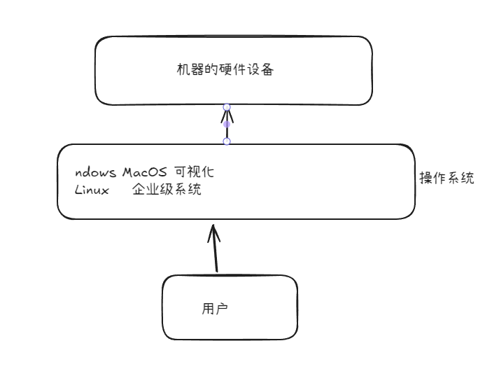
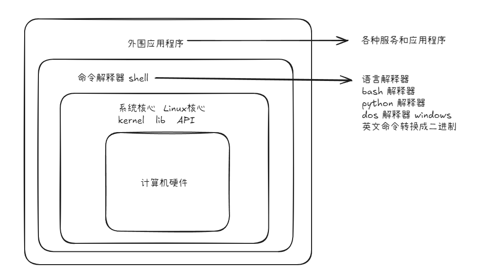
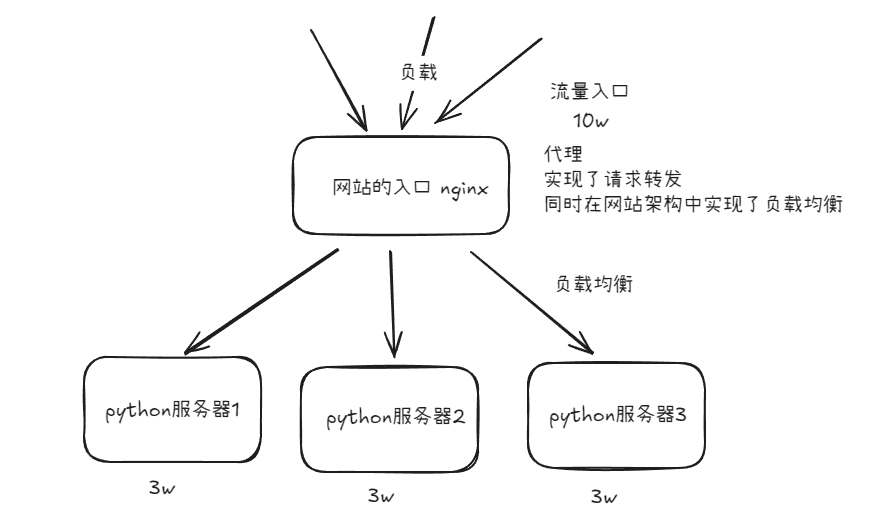
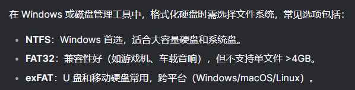
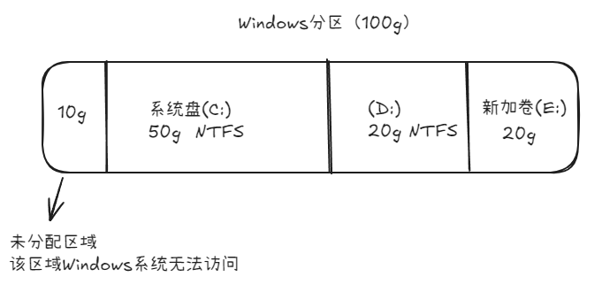
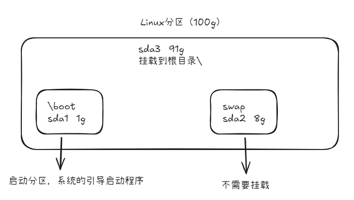
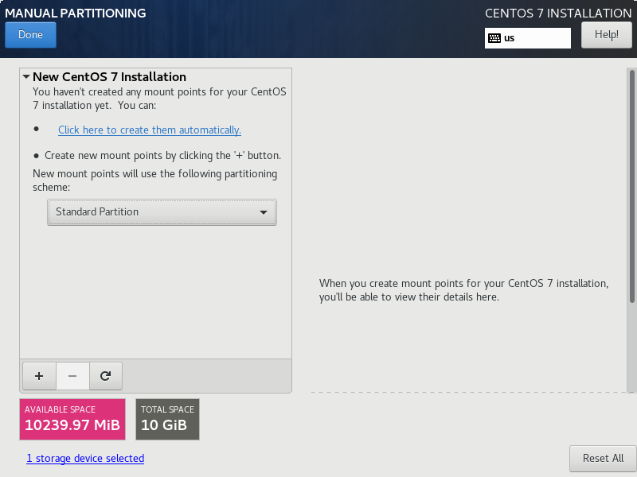
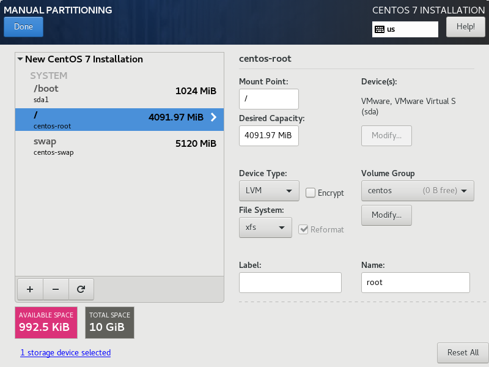

# 操作系统相关知识

**操作系统（Operating System）简称OS**

直接管理计算机的硬件资源，如对CPU，内存，磁盘的管理
同时对操作系统供需的优先次序进行管理

操作系统和需要和cpu搭配

 

## 操作系统组成

关于不同操作系统的命令行

- Windows：DOS——磁盘操作系统（Disk Operating System）
- Linux：bash/terminal——Unix shell的一种软件



web服务器搭建网站基本使用的是

- Linux系列：nginx，apache
- windows系列：IIS


## Unix

诞生于1969年的贝尔实验室，使用汇编语言开发，收费，原本用于军事研究，在20世纪70年代非常盛行，在此期间产生了重要的一个分支：BSD系统
从BSD系统开始，各大厂商开始产生了各种版本的Unix系统

在互联网开源技术没有流行的时候，百度，腾讯，淘宝公司往往都会从这些国外公司购买小型机+系统，价格非常昂贵

由于政府对于Unix系统的版权和代码限制问题，斯托曼发起了自由软件运动（这一运动最后造就了GPL通用公共许可协议），当时发展了很多根据BSD系统开发的很多新的系统，具有代表的是谭宁邦开发的用于教学的Minix系统，1991年 林纳斯·托瓦兹根据Minix系统创造了Linux系统，这个人还开发了git，同样开源

## Linux

Linux系统有N多分支，如CentOS，ubuntu，Android
大多数为命令行版本，但是也有包括桌面版ubuntu等图形化系统，其中macos也是linux的一种

Linux源代码开源，可以自由传播的类Unux操作系统软件，支持多用户，多任务，多线程和多CPU的操作系统

> 嵌入式开发的机器人，往往都是在主板上装一个ubuntu，然后程序员使用ssh远程控制发指令

Linux系统包括了2部分

- linux是系统内核的名字
- 各种发行版的代码：比如CentOS的代码，它使用yum的命令管理软件，而Ubuntu使用apt命令管理软件

Linux作为企业级服务器应用十分广泛，利用Linux系统可以为企业架构www服务器，数据库服务器，负载均衡服务器，邮件服务器，dns服务器，代理服务器



## vmware虚拟机

vmware提供虚拟环境 + 虚拟硬件设备 + 你提供的系统镜像（必须符合该机器的cpu架构）

> 现在macos的苹果电脑往往使用的是非intel芯片，而是自己开发的m1芯片，如果你的镜像是centOS7-x86_65_intel.iso则不能使用，需要重新找一个兼容的镜像

vmware所创建的虚拟机，每一个都是通过安装的，完整的操作系统（和docker不同），这有以下缺点

- 配置降低
- 吃资源（针对宿主机）

但是能够构建完全隔离的虚拟环境

## 硬盘分区

在买到一个新的硬盘后，需要作的就是格式化分区

分区本质是逻辑分区

 

在Windows系统中，分区也就是所谓的分盘符，通过这种操作来让文件放在不同位置

此时分区的作用是：管理存储空间，隔离系统和用户数据，用户可以通过盘符来访问对应的分区



而在Linux系统中，分区不会影响整个系统的目录，而是将某个分区挂载在某个目录下，访问这个目录时即是访问这个分区

> 在Linux中，/dev/sda1是硬盘分区的设备文件名，命名规则为：
>
> - `/dev/`    Linux的设备文件目录，所有的硬件均以文件的形式存储在此
> - `sd `          表示块存储设备，包括硬盘，U盘等，`hd`表示旧版IDE硬盘
> - `a`             第一块硬盘被称为`a`，第二块为`b`
> - `1`             分区编号          

**Swap（交换分区）** 是 Linux 系统中用于扩展内存（RAM）的**虚拟内存空间**。当物理内存不足时，系统会将部分不活跃的内存数据临时存储到 Swap 分区中，从而避免程序崩溃或系统卡死

- **不需要手动挂载**
	Swap 分区**不关联任何目录**（如 `/boot` 或 `/home`），而是由系统内核直接管理。

- **激活方式**：
	在 `/etc/fstab` 中配置后，系统启动时会自动启用 Swap。例如：

	```plaintext
	/dev/sda3 none swap sw 0 0
	```



接下来展示使用centos系统在安装界面通过可视化操作进行分区

1. 选择手动分区并点击done进入分区页面，给这个新的虚拟硬盘分成几个区域

2. 选择Standard Partition 标准分区



3. 点击 + 号进行分区，并设置容量，分区完成默认使用的 File System使用xfs
	这里将分区1挂载到/boot后，将sda2挂载到/，还需要swap分区，这个分区不挂载



