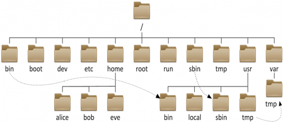

# Linux相关概念

详细内容参考网站：[Linux命令大全(手册) – 真正好用的Linux命令在线查询网站](https://www.linuxcool.com/)

## 基本规则

- Windows中不区分大小写，而Linux中严格区分大小写
- 使用ls等命令查看到的内容中，蓝色是目录，白色是文件
- Linux不关心后缀，文件属性依靠`权限位`决定，和文件名无关，linux就是个普通的字符串

## Linux目录结构

*参考内容：[linux系统目录结构 - 运维派](https://www.yunweipai.com/33859.html)*



`/boot`：引导文件存放目录，内核文件(vmlinuz)、引导加载器(bootloader, grub)都存放于此目录
`/bin`：所有用户使用的基本命令；不能关联至独立分区，OS启动即会用到的程序
`/sbin`：管理类的基本命令；不能关联至独立分区，OS启动即会用到的程序
`/lib`：启动时程序依赖的基本共享库文件以及内核模块文件(/lib/modules)
`/lib64`：专用于x86_64系统上的辅助共享库文件存放位置
`/etc`：配置文件目录
`/home/USERNAME`：普通用户家目录
`/root`：管理员的家目录
`/proc`：虚拟文件系统
`/run`：存放系统运行时的临时文件，重启后清除
`/var`：存放频繁变化的文件，包括：日志`/var/log`，邮件`/var/mail`，数据库`/var/lib/mysql`，缓存`/var/cache`
`/media`：便携式移动设备挂载点
`/mnt`：临时文件系统挂载点
`/dev`：设备文件及特殊文件存储位置
`/opt`：第三方应用程序的安装位置
`/srv`：系统上运行的服务用到的数据
`/tmp`：临时文件存储位置
`/usr`：存放只读的用户工具和应用程序

与Windows相同，Linux同样支持相对路径和绝对路径，此外还有一些特殊目录：

这两个目录在每一个目录中都作为隐藏目录存在
`.`：表示当前目录
`..`：表示上一级目录

`~`：表示当前用户的家目录
`-`：表示上一次使用的目录

## Linux中一切皆文件

在Linux系统中，所有的操作，都会以文件的形式找到，例如：
网站配置，软件配置，程序脚本，进程信息
这些都可以使用命令找到和他有关的文件

```bash
systemctl   服务管理命令
status      状态参数
systemctl status network   用于查看network服务状态
[root@10 Desktop]$ systemctl status network
● network.service - LSB: Bring up/down networking
   Loaded: loaded (/etc/rc.d/init.d/network; bad; vendor preset: disabled)
   Active: active (exited) since Sun 2025-06-29 22:04:21 CST; 23h ago
     Docs: man:systemd-sysv-generator(8)
  Process: 1023 ExecStart=/etc/rc.d/init.d/network start (code=exited, status=0/SUCCESS)
    Tasks: 0

Jun 29 22:04:20 localhost.localdomain systemd[1]: Starting LSB: Bring up/down networking...
Jun 29 22:04:21 10.96.0.129 network[1023]: Bringing up loopback interface:  [  OK  ]
Jun 29 22:04:21 10.96.0.129 network[1023]: Bringing up interface ens33:  [  OK  ]
Jun 29 22:04:21 10.96.0.129 systemd[1]: Started LSB: Bring up/down networking.

systemctl start network   开启网络服务
systemctl stop network    关闭网络服务，此时ssh远程连接会关闭
```

服务在linux上指的就是软件程序

配置虚拟机上网的方法：

1. 网线
2. 修改网卡信息     路径：`/etc/sysconfig/network-scripts/ifcfg-ens33`
3. 启动network程序   `systemctl start network`

```bash
[root@10 ~]$ cat /etc/sysconfig/network-scripts/ifcfg-ens33
TYPE="Ethernet"
PROXY_METHOD="none"
BROWSER_ONLY="no"
BOOTPROTO="dhcp"
DEFROUTE="yes"
IPV4_FAILURE_FATAL="no"
IPV6INIT="yes"
IPV6_AUTOCONF="yes"
IPV6_DEFROUTE="yes"
IPV6_FAILURE_FATAL="no"
IPV6_ADDR_GEN_MODE="stable-privacy"
NAME="ens33"
UUID="88a363d8-4da0-4200-aee4-07b2ca22cafb"
DEVICE="ens33"
ONBOOT="yes"
```

与网卡相同，可以通过在linux系统中通过文件操作硬盘，路径`/dev`

```bash
[root@10 ~]$ ls /dev/sd*					
这里使用的是通配符，ls cp 等命令都支持通配符
/dev/sda  /dev/sda1  /dev/sda2
```

> 通配符`*`表示所有匹配的字符，使用`ls ..`可以显示上一级目录，使用`ls ./`表示显示当前目录

## Linux环境变量PATH

由于Linux中一切皆命令的概念，所有我们使用的命令本质上也是一个文件，通过`which`命令可以看到这些命令的具体文件路径

```bash
which  能够从PATH中找到命令的绝对路径并输出
[warghost@war ~]$ which ls
alias ls='ls --color=auto'
	/usr/bin/ls
```

直接使用对应的路径同样可以使用这个命令

```bash
[root@war /]$ ls
bin   dev  home  lib64  mnt  proc  run   srv  tmp  var
boot  etc  lib   media  opt  root  sbin  sys  usr

[root@war /]$ /usr/bin/ls
bin   dev  home  lib64	mnt  proc  run	 srv  tmp  var
boot  etc  lib	 media	opt  root  sbin  sys  usr
```

`PATH`本质是一个Linux的路径搜索变量，作用是可以让我们快速使用Linux命令而不使用路径
能够输入简写的命令原因是， Linux在PATH变量中寻找了

`${PATH}`是shell语法，表示一个名为PATH的变量

```bash
[warghost@war ~]$ echo ${PATH}
/usr/local/bin:/usr/bin:/usr/local/sbin:/usr/sbin:/home/warghost/.local/bin:/home/warghost/bin
```

`PATH`变量通过使用`:`分隔多个绝对路径，在查找时从前向后搜索目录

除了命令之外，Linux支持的tab补全也是通过PATH

> shell定义变量并赋值语法：
>
> ```bash
> [warghost@war ~]$ name=test
> [warghost@war ~]$ echo ${name}
> test
> [warghost@war ~]$ echo $name
> test
> ```

Linux中每个用户都会有自己独立的一套环境变量PATH，且进入该目录
比如：root用户安装了java程序，PATH中且添加了java相关的命令，直接使用java命令（相对命令），而warghost用户未安装，切换到该用户时无法使用java命令

这涉及到用户配置文件的加载，对应`~/.bash_profile`
作用是针对用户个人添加的一些额外配置，例如个人安装某软件，加入PATH后方便使用

> 在Linux中，以`.`开头的文件通常被shell**识别为隐藏文件**，本质是普通文件，只是为了防止操作干扰而隐藏

## 文件命名规则

除了字符`/`以外，其余字符都可以使用，但在目录和文件名中不建议使用特殊字符，如：`< > ? *`等
如果文件名包含了包括空格在内的特殊字符，在访问这个文件的时候则需要使用`''`

此外，还通常使用`_`对文件名进行分割

```bash
[yxz@war ~]$ touch 'test?'
[yxz@war ~]$ ls
test?
```

可以使用转义字符`\`来对特殊符号进行转义处理

```bash
[yxz@war test]$ stat test3\ test 
  File: ‘test3 test’
  Size: 0         	Blocks: 0          IO Block: 4096   regular empty file
Device: fd00h/64768d	Inode: 4213042     Links: 1
Access: (0664/-rw-rw-r--)  Uid: ( 1001/     yxz)   Gid: ( 1001/     yxz)
Context: unconfined_u:object_r:user_home_t:s0
Access: 2025-07-08 12:00:38.427212484 +0800
Modify: 2025-07-08 12:00:38.427212484 +0800
Change: 2025-07-08 12:00:38.427212484 +0800
 Birth: -
```

## 特殊符号

```bash
'' 和 ""
Linux中，单引号''表示纯字符串，不作特殊符号转义，"" 表示字符串的同时能够识别特殊符号

>  输出重定向操作符，将信息输出覆盖写入到指定文件中
[root@10 Desktop]$ ls > test3
[root@10 Desktop]$ cat test3
test
test2
test3
[root@10 Desktop]$ echo "Hello World" > test3
[root@10 Desktop]$ cat test3
Hello World

还可以直接删除文件内容
[root@10 Desktop]$ > test3
[root@10 Desktop]$ cat test3

>>  同样是输出重定向操作符，将信息输出添加到文件末尾
[root@10 Desktop]$ echo "More" >> test3
[root@10 Desktop]$ cat test3
Hello World
More
```

> 在使用这些特殊符号的过程中，还会涉及到关于**文件描述符**的概念，比如`2>`表示**标准错误重定向到文件**

