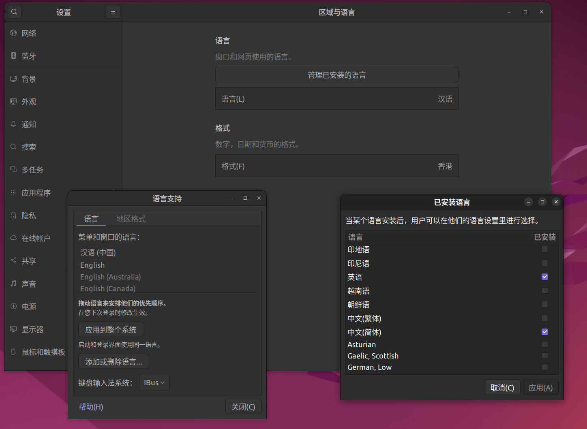

# vmware安装ubuntu虚拟机

vmware版本：vmware Workstation 17.5

ubuntu镜像版本：ubuntu-22.04.5-desktop-arm64.iso

首先创建虚拟机，然后添加镜像，选择iso镜像文件安装ubuntu系统


开启虚拟机，进入系统安装界面，这里先保存一个镜像以备不时之需

> 这里建议硬盘容量至少为20GB，虽然系统并不会占用20GB，但是后续安装会提示至少20GB才能安装

## 安装Ubuntu系统

安装引导会让你选择语言

这里选择English，如果选择中文的话会导致treminal的提示信息显示为中文，一些报错或者警告不方便查阅，后续可以通过安装中文安装包解决键盘等问题


然后是键盘选择，如果第一步没有选择中文的话这里不会出现中文键盘选项，直接选默认的English(US)即可


接下来选择安装软件，这里勾选最后一个选项，**install third-party software for graphics and Wi-Fi hardware and additional media formats** 是指**安装第三方闭源/专利相关的软件包**，包括一些显卡驱动，无线网卡驱动等

选择会影响视频解码等问题


下一步会提示格式化磁盘来安装ubuntu，如果安装的磁盘原本有一些文件，会导致这些文件被跟着格式化，不过虚拟机不担心这个问题

Something else 无法选择，这个选项一般用于双系统的磁盘挂载等操作，选择Erase disk and install Ubuntu 会自动硬盘分区


设置用户名，设备名称，密码

这个选项 **`Use Active Directory`** 是给企业/学校环境用的，一般家庭用户完全不需要勾选。

------

### 含义

- **Active Directory (AD)** 是 **微软 Windows Server** 提供的一套集中式目录服务。
- 在企业/校园里，IT 部门会用 AD 管理：
	- 用户账号（统一登录）
	- 密码策略
	- 权限分配（比如能不能访问某个文件夹、打印机）
	- 设备统一管理

Ubuntu 从 20.04 开始安装时就提供了一个选项：
 👉 如果勾选了，它会让 Ubuntu 加入 Windows 的 AD 域（Domain），这样你就可以用公司/学校的账号密码直接登录 Ubuntu，并且受 AD 的策略控制。

------

### 举例

- 在公司里，你用 Windows 电脑登录账号 `zhangsan@company.com`。
- 如果 Ubuntu 加入了 AD，你在 Ubuntu 登录时也能直接用 `zhangsan@company.com` 登录。
- 系统权限（能不能装软件、能不能访问共享盘）由 IT 管理员通过 AD 控制。


到这里Ubuntu系统就安装完毕了

---

## 配置中文支持

为了确保treminal中的一些输出是英文的，在配置language时下载了英文，下载安装包以支持中文

安装命令

```bash
sudo apt-get install language-pack-zh-hans
```

然后添加中文支持

```bash
sudo locale-gen zh_CN.UTF-8
```

> 在ubuntu中，root用户被锁定，且默认没有密码，因此无法使用`su` 切换到root，此时 `su `会显示
>
> ```mathematica
> Authentication failure
> ```
>
> 通常建议使用`sudo`来完成操作，更加安全的同时，日志还能记录该操作

setting中查找 **区域与语言** 选择管理已经安装的语言，选择添加或者删除语言，添加中文并应用

