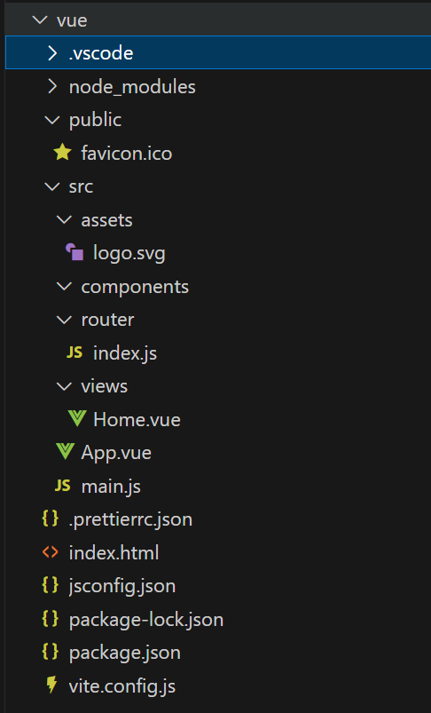

# vue3项目结构解析

调整完成后的vue3项目

- **node_modules**：存放下载的依赖项

- **public**：存放**全局**静态文件，包括网页的icon

- **src**

	- **assets**：存放代码引用的静态文件，例如：css，js，img

	- **conpoents**：vue组件，可以复用的代码块

	- **router**：定义路由的文件，定义路由用来访问views中的网页文件	

	- **views**：存放vue网页的文件的目录
	
- **App.vue**：vue 页面的全局入口，所有vue页面的父级

- **main.js**：代码的配置文件，用于引入第三方的组件，或者自己定义的组件，css，js等

- **index.html**：vue最终会编译成html网页在浏览器中渲染

- jsconfig.json：内部的配置文件

- **package.json**：定义依赖库的文件

- **package-lock.json**：在下载依赖的时候指定依赖的版本

- **vite.config.js**：vue3 通过vite搭建，是全局的配置文件