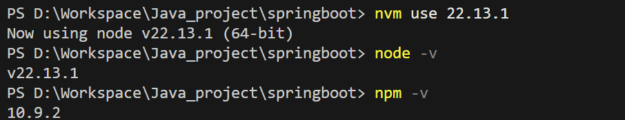

# 使用nvm进行node.js版本管理

参考文章：
[nvm安装教程（一篇文章所有问题全搞定，非常详细）-CSDN博客](https://blog.csdn.net/jiangjunyuan168/article/details/134216065)
[node.js与npm的版本与Vue2和Vue3版本运行，nvm的使用_vue2支持的node版本-CSDN博客](https://blog.csdn.net/maliao5/article/details/136813711)
[nodejs 和 npm 版本对应关系 - 橙子家 - 博客园](https://www.cnblogs.com/hnzhengfy/p/18393301/nodejs_npm)

## 卸载node

使用nvm可以对多个node.js版本进行管理，但是在安装之前需要先卸载本地的node.js

参考文章：[使用nvm管理node多版本（安装、卸载nvm，配置环境变量，更换npm淘宝镜像）_node 版本管理-CSDN博客](https://blog.csdn.net/goods_yao/article/details/137854626)

在控制面板中删除node.js，同时还要
删除以下文件夹（如果存在的话）
C:\Program Files (x86)\Nodejs
C:\Program Files\Nodejs
C:\Users{User}\AppData\Roaming\npm
C:\Users{User}\AppData\Roaming\npm-cache
删除C:\Users\用户名 下的 .npmrc文件以及 .yarnrc 文件
环境变量中npm、node的所有相关统统删掉

## 安装nvm

安装地址：[Releases · coreybutler/nvm-windows](https://github.com/coreybutler/nvm-windows/releases)

修改路径为D盘，创建nodejs文件夹作为路径，剩下的直接默认


## 配置路径和下载地址

修改文件`D:\nvm\settings.txt`，新增如下内容：

```txt
node_mirror: https://npmmirror.com/mirrors/node/
npm_mirror: https://npmmirror.com/mirrors/npm/
```


此时安装完成，使用命令

```powershell
nvm      #查看详细信息
nvm -v   #查看版本
```


## nvm的基本命令


```powershell
nvm -v                 #查看版本
nvm ls available       #查看可下载的 nodejs版本
nvm i [nodejs版本号]    #安装指定版本的nodejs
nvm uninstall [nodejs版本号]		#卸载指定版本的nodejs
nvm ls 							  #查看当前系统中有的nodejs
nvm use [nodejs版本号]				#切换使用的nodejs版本

nvm help 				#查看更多命令
```

## 安装nodejs

使用命令查看可以下载的nodejs版本，使用命令下载 **v22.13.1**，这个版本可以稳定vue3项目




再安装一个 **v16.14.0 **用于兼容vue2项目，对应的npm版本为：**8.3.1**


## 修改npm默认镜像源为淘宝镜像

选在使用的nodejs版本后，用命令修改npm默认镜像

```powershell
npm config set registry https://registry.npmmirror.com
npm config get registry
```

## 环境变量配置

为了指定npm在安装包时的下载位置，调整环境变量

在之前的选择的nodejs目录中新增文件夹 node_global  node_cache


然后使用命令修改npm配置

```powershell
npm config set prefix "D:\nodejs\node_global"
npm config set cache "D:\nodejs\node_cache"
```

在系统环境变量中添加对应的路径


添加 NODE_HOME为指定路径


使用命令安装express包成功


