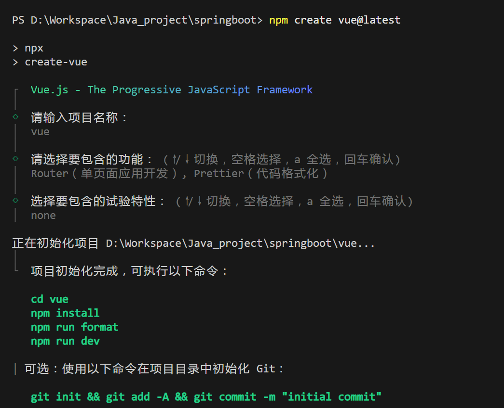
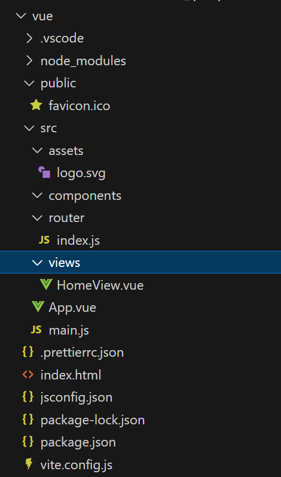

# 前端vue3框架的快速搭建

## 安装Node.js

vu3推荐的使用 **node.js v22.13.1**，当前我使用的版本是**v20.18.1**

npm 推荐版本为：10.9.2，当前我使用的版本是 11.1.0

npm 通过如下命令配置淘宝镜像

```powershell
npm config set registry https://registry.npmmirror.com
```

通过如下命令可以看到 npm 的详细配置信息

```powershell
npm config ls -l              #查看详细信息
npm config get registry		  #查看镜像
```

## 通过脚手架搭建vue工程

```powershell
npm create vue@latest
```



```powershell
npm i     #安装需要的依赖
npm run dev   #运行项目
```

精简整个项目



修改 `HomeView.vue`为`Home.vue`‘，调整里面内容

```vue
<template>
	<div>
		主页
	</div>
</template>

<script setup>

</script>
```

修改`App.vue`中内容，保留`RouterView`

```vue
<template>
	<RouterView />
</template>
```

删除`AboutView.vue`，精简`router\index`

```javascript
import { createRouter, createWebHistory } from 'vue-router'

const router = createRouter({
  history: createWebHistory(import.meta.env.BASE_URL),
  routes: [
    {
      path: '/',
      name: 'home',
      component: () => import('../views/Home.vue'),
    },
  ],
})

export default router
```

删除`main.js`中关于`main.css`的调用

```javascript
import { createApp } from 'vue'
import App from './App.vue'
import router from './router'

const app = createApp(App)

app.use(router)

app.mount('#app')
```

## 设置网页标题

修改`index.html`中的`<title>`标签

```html
<!DOCTYPE html>
<html lang="">
  <head>
    <meta charset="UTF-8">
    <link rel="icon" href="/favicon.ico">
    <meta name="viewport" content="width=device-width, initial-scale=1.0">
    <title>springboot项目搭建</title>
  </head>
  <body>
    <div id="app"></div>
    <script type="module" src="/src/main.js"></script>
  </body>
</html>
```

## 设置全局global.css并调用

在`assets`目录中添加`gloabl.css`

```css
* {
	box-sizing: border-box;
}

body {
	margin: 0;
	padding: 0;
	color: #333;
	font-size: 14px;

}

a {
	text-decoration: none;
}
```

修改`main.js`引入

```js
import './assets/css/global.css'
```

## 配置新页面的路由

在views目录中，添加新页面文件About.vue

```vue
<template>
	<div>
		关于
	</div>
</template>
```

然后在router/index.js中配置对应的路由

```js
 routes: [
    {
      path: '/', name: 'home',component: () => import('../views/Home.vue'),
      path: '/about', name: 'about',component: () => import('../views/About.vue'),
    },
```

## 配置404页面

在 assets 中添加imgs目录，放入404展示的图片，在 404.vue中调用

```vue
<template>
	<div>
		
	</div>
</template>
```

配置对应的路由

```js
path: '/notFound', name: '404',component: () => import('../views/404.vue'),
```

通过html语法调整页面布局

```html
<template>
	<div style="height: 100vh; display: flex; justify-content: center; align-items: center;">
		
	</div>
</template>
```

添加一个返回页面的选项，并单独设置颜色，完整代码：

```html
<template>
	<div style="height: 100vh; display: flex; justify-content: center; align-items: center;">
		<div style="width: 50%;">
			
			<div style="text-align: center; padding: 20px 0; font-size: 20px;"><a style="color: blueviolet;" href="/">返回主页</a></div>
		</div>
	</div>
</template>
```

设置错误路由时重定向到404页面

```js
{ path: '/:pathMatch(.*)', redirect: '/notFound'},
```

index.js 完整代码：

```js
import { createRouter, createWebHistory } from 'vue-router'

const router = createRouter({
  history: createWebHistory(import.meta.env.BASE_URL),
  routes: [
    { path: '/', name: 'home',component: () => import('../views/Home.vue'), },
	{ path: '/about', name: 'about', component: () => import('../views/About.vue'), },
	{ path: '/notFound', name: '404', component: () => import('../views/404.vue'), },
	{ path: '/:pathMatch(.*)', redirect: '/notFound'},
	
	],
})

export default router
```

