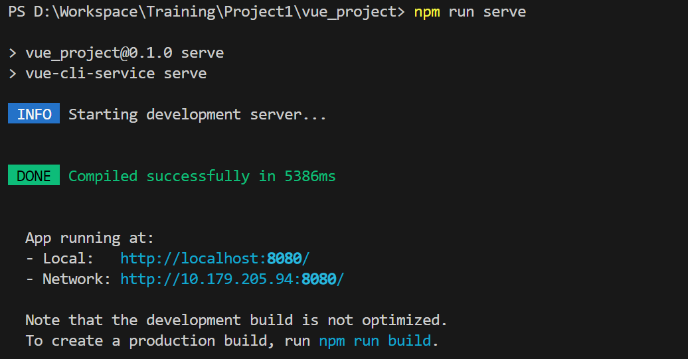

# Vue环境配置（VScode）

---

记录下专业实训第一天Vue的相关环境配置，以及创建github本地仓库所使用的初始化命令，

###### 2025年1月2日09:58:28

---

## 1.开发环境安装步骤

步骤如下：

1. 下载安装node.js（已完成）
2. 安装npm（已完成）
3. 安装cnpm（已完成）
4. **安装vue/cli脚手架**
5. 创建vue项目，同时创建git本地仓库和gihub远程仓库
6. 运行vue项目
7. 配置VScode相关插件

参考文章**：*VS Code上搭建Vue开发环境超详细教程***[link](https://blog.csdn.net/weixin_49136054/article/details/129624923)

---

## 2.下载安装node.js

参考文章**：*2024最新版Node.js下载安装及环境配置教程【保姆级】***[link](https://blog.csdn.net/WHF__/article/details/129362462)

Node.js的配置曾经出现过不少问题，尤其是安装npm以及镜像cnpm时，由于这里已经配置完成因此无法描述当时出现的问题，简单附上相关的命令

- 安装后测试node.js版本，以及自带的npm版本

~~~bash
node -v
npm -v
~~~

- 安装国内镜像cnpm

```bash
npm install -g cnpm --registry=https://registry.npmmirror.com
cnpm -v
```

---

## 3.创建vue项目

- 安装vue脚手架，终端命令

	~~~bash
	cnpm install -g @vue/cli
	~~~

- 安装成功检验

	~~~bash
	vue -V
	~~~

- 使用命令创建vue项目，命令输入后连续2次回车完成默认项目创建，同时可以在键盘上下能够对项目进行配置

	~~~bash
	vue create vue_project	//项目名称
	~~~

使用命令行创建vue项目的详细方法解释文章：

***2024年Web前端最全Vue脚手架搭建以及创建Vue项目流程_脚手架创建vue项目[link](https://blog.csdn.net/2401_84122782/article/details/138695909?utm_medium=distribute.pc_relevant.none-task-blog-2~default~baidujs_baidulandingword~default-4-138695909-blog-129624923.235^v43^pc_blog_bottom_relevance_base9&spm=1001.2101.3001.4242.3&utm_relevant_index=7)***

---

**出现问题**：

用脚手架创建项目时出现：

*无法加载文件 D:\nodejs\node_global\vue.ps1。未对文件 D:\nodejs\node_global\vue.ps1 进行数字签名。无法在当前系统上 运行该脚本*

**解决方法：打开D:\nodejs\node_global目录，删除vue.ps1文件，重新使用命令创建项目即可。**

---

## 4.vue项目运行

通过脚手架vue/cli创建vue项目后，可以运行项目

- 运行项目

	~~~bash
	npm run serve
	~~~

	运行结果：

	

点击`http://localhost:8080/`可以进入Vue的默认界面


Vue CLI 创建的项目结构如下：

```mathematica
my-vue-project/
├── node_modules/      # 依赖包
├── public/            # 静态资源
├── src/               # 源代码
│   ├── assets/        # 图片、样式等资源
│   ├── components/    # 组件
│   ├── App.vue        # 根组件
│   └── main.js        # 入口文件
├── .eslintrc.js       # ESLint 配置
├── .gitignore         # Git 忽略文件
├── babel.config.js    # Babel 配置
├── package.json       # 项目依赖和脚本
└── README.md          # 项目说明
```