# 运维网络基本知识

## 传统运维

指的是没有接触到云计算，没有接触云服务器的，运维工程师
需要维护企业内的硬件设备，服务器，以及机房的维护

主要维护是企业内部的，不经常变化，且没有超大流量的内部应用

## 机房（IDC）

对于IDC运维来说，大部分时间在机房中度过

### 服务器基本单位

磁盘阵列存储：多个硬盘通过技术组成一个整体高性能的硬盘集群

U的概念：U是表示服务器尺寸的单位，是unit的缩写
1U指的是服务器的厚度，固定是4.445cm

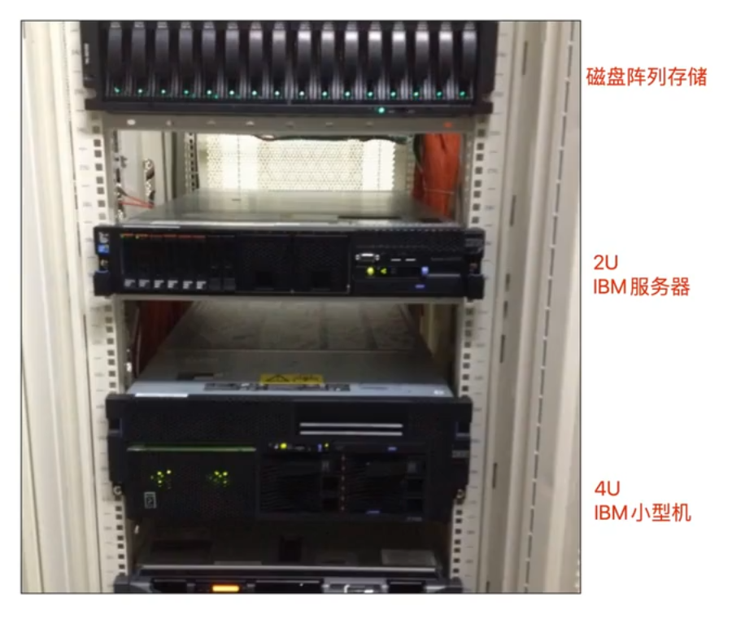

---

## 服务器的定义

广义：专门给其他机器提供服务的计算机

狭义：高性能计算机，通过网络为外部计算机提供一些业务服务

通常服务器内存是128g起步

硬件实体服务器大概4类：塔式服务器，刀片服务器，机式服务器，柜式服务器

---

## ip地址

特殊ip地址：

- 127.0.0.1
	- 回环地址
	- ip从127.0.0.0到127.255.255.255都将环回到本地主机中
	- 也就是发送的数据在电脑主机中绕圈
	- 一般用于程序运行在本地，测试访问本机的该程序
	- localhost本质是一个域名，通常与127.0.0.1绑定
- 0.0.0.0
	- 在服务器中指的是本机上的所有IPV4地址，如果一个主机有2个ip地址，且有一个服务监听地址为0.0.0.0:8080，那么2个ip地址都能访问该服务

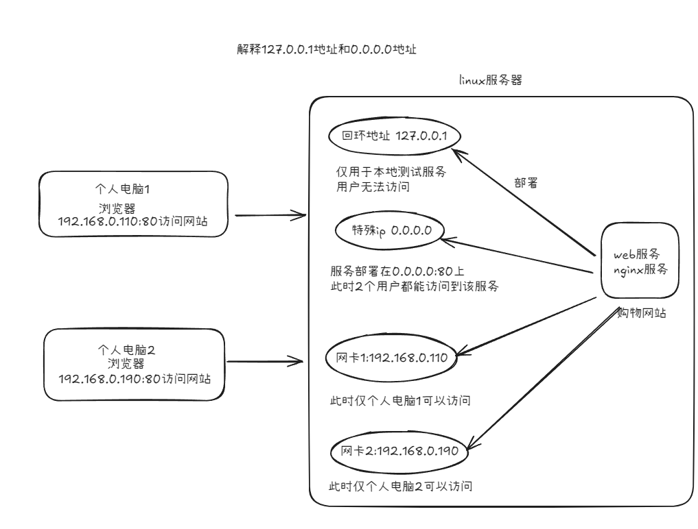

程序部署的3种情况

1. 程序仅在本地运行，作为测试，运行在127.0.0.1:80 上
2. 服务器仅有1个网卡，假设ip为192.168.0.110，程序运行在192.168.0.110:80上
3. 服务器有多个网卡，可以将程序绑定在0.0.0.0:80上，**但是用户需要访问任意网卡的ip**

## 自动化技术的应用：

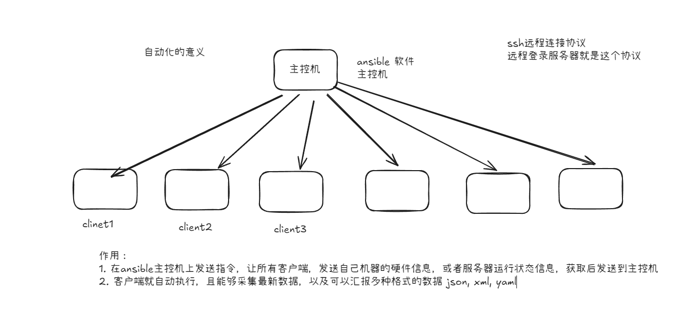

## 关于局域网 NAT

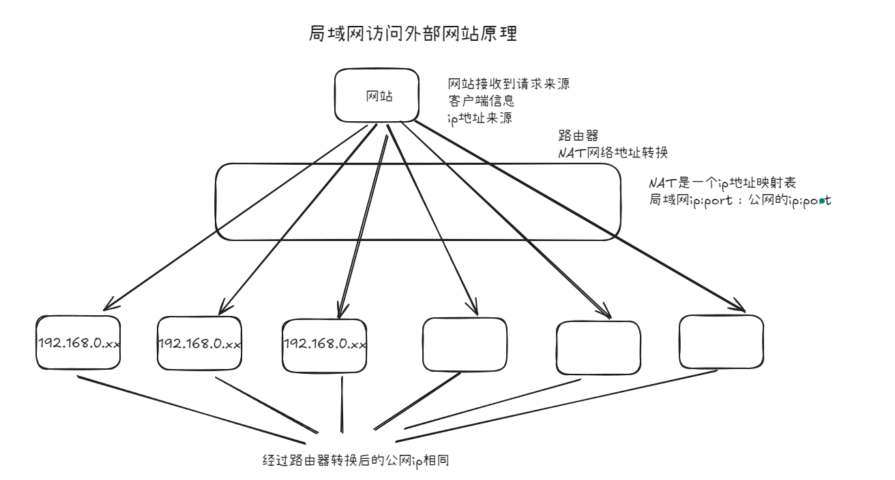

## 域名

任何连接到互联网的电脑都可以通过一个公共ip地址访问到，但是ip地址难以记忆，也容易变化
因此使用域名访问服务器，域名就是找到服务器位置的一串字母数字的组合，例如：www.bilibili.com

域名是不变的，ip是变化的

### 域名的规则

一个域名由多个部分组成，可以是一个或者多个部分组成，并用.分隔

**同时需要从右往左阅读**

> 当访问`taobao.com`时，服务器自动返回`www.taobao.com`，属于**nginx**部署的**url**重写机制


- 顶级域名TLD：通常表示服务类型
	- 表示公司或者企业`.com`
	- 表示提供网络服务的`.net`
	- 表示开源组织的`.org`
	- 表示政府网站`.gov`
- 买域名买的就是2级域名

可以通过腾讯云购买一个个人域名，同时可以在腾讯云中自己配置相关的域名解析服务

同样也可以自己搭建linux的域名解析服务（**bind**）

云服务器中通常有2个ip，公网ip供用户使用，内网ip供服务器集群使用

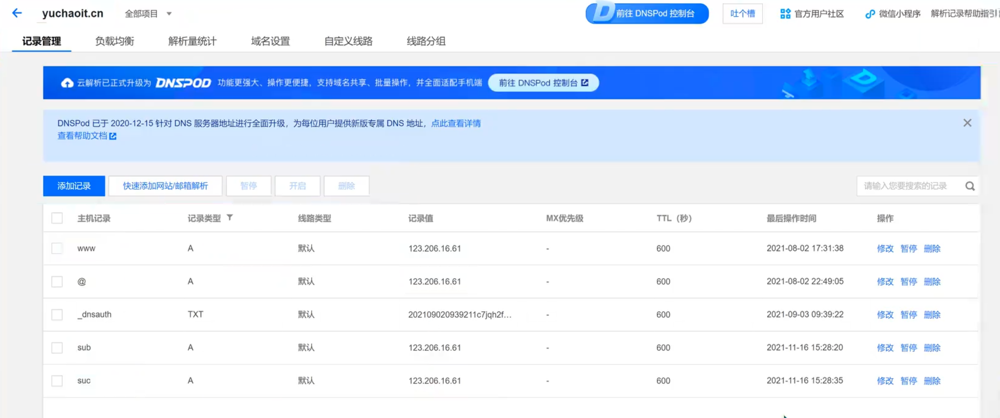

## 端口

Linux上查看端口是否监听

```bash
netstat -tnlp |grep 443
```

端口的作用在于表示一个服务，该端口存在，表示该端口提供服务

>  当杀死服务，使用ping命令仍然能够ping通，是因为ping测试的是**ICMP协议（网络层）**，仅验证服务器ip是否在线，网络是否可达到，与具体服务无关
>
> 浏览器发起的是 **HTTP/HTTPS 请求**（应用层），依赖具体的服务

## NAT网络模式

> 一个新的Linux虚拟机需要修改**/etc/sysconfig/network-scripts**下的对应网卡设置，将对应网卡配置文件中的ONBOOT修改为yes
>
> 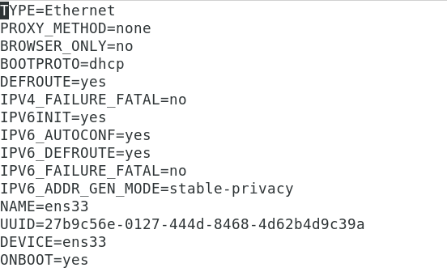

桥接模式下虚拟机网卡占用一个ip地址

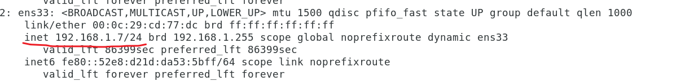

NAT模式能够解决当存在超过255台机器的情况下，桥接模式1台电脑会占用1个ip的问题

添加ip的方法：

1. 添加新网卡并绑定ip
2. 直接给当前网卡绑定多个ip

通过修改vmware的网络连接方式修改网络连接模式，可以看到NAT模式用于共享主机的ip地址

NAT本质是有创建了一个假的局域网（子网），虽然同样上限是255，但是不会占用宿主机的物理网络ip，创建的NAT只和你的电脑有关

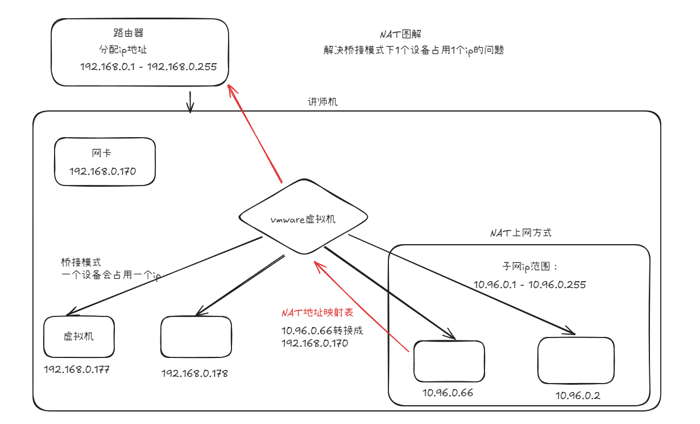

通过管理员权限访问虚拟网络编辑器，可以看到子网的ip是从10.96.0.0

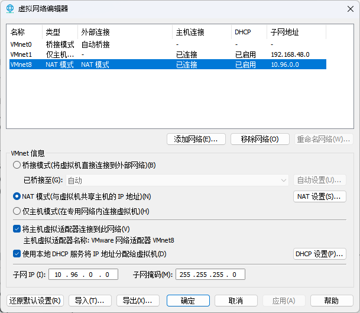

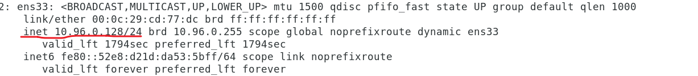

## 域名和ip的对应关系

基本来说是1对1的关系

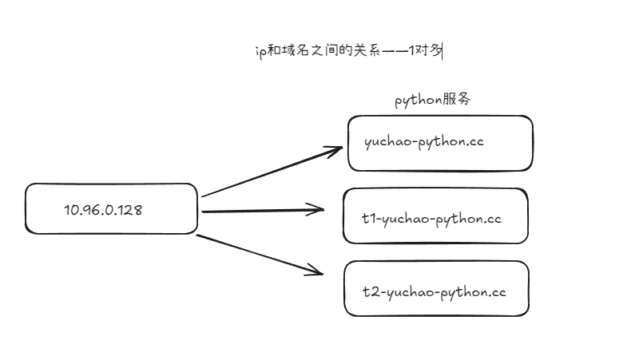

> 当使用不同电脑ping 百度域名时可能对应的是不同的ip，这和百度的动态DNS解析技术相关

## 域名解析的配置hosts文件

是每个电脑上的，域名解析文件，适用于本地测试使用的
也就是能实现访问 **yuchao-python.cc**就可以定位到**10.96.0.128**

互联网中存在的域名是需要购买dns解析记录的

在C:\Windows\System32\drivers\etc中找到hosts文件，并修改文件内容

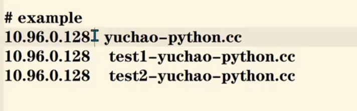

同时访问域名+端口即可实现本地域名的解析

**通过这种方式可以实现多个域名解析同一个ip地址**
