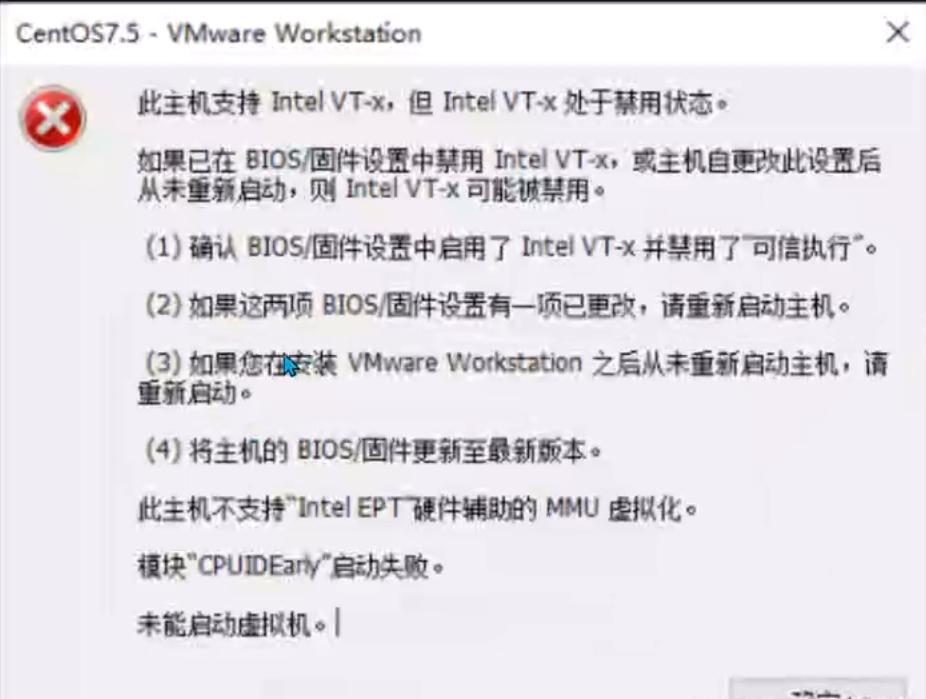

# 硬件相关知识

## 运维需要了解的硬件知识

程序跑在服务区上，运维需要了解服务器的配置问题

cpu型号，内存的版本，频率，内存容量
磁盘（管理，格式化，文件系统）

流程

1. 用键盘输入字符
2. cpu通过操作系统将字符写入内存

## CPU

**关于CPU的32位和64位**
指的是最大内存寻址空间，也就是处理器可以在一段时间内处理的最大位数
32位的cpu能使用的最大内存是4G = 2^32

cpu和主板必须要是配套的，不同的cpu有不同的针脚，搭配的主板芯片也不同

## 内存以及使用场景

内存会大量使用在网站的架构优化里

只有有足够的服务器，内存够大

数据尽量放在内存里，因为内存速度快

内存的多通道设计

主板支持插入4个内存条，两两配对是最佳性能的
单条16g内存条，不如买2个8g（完全一样型号，品牌的），组成双通道

## 硬盘

个人硬盘，台式机的硬盘，都是STAT接口，而企业级的高性能硬盘都是SAS接口

在企业里特别是服务器的优化场景，硬盘的性能往往决定网站的性能

目前常使用的硬盘分为**机械硬盘（HDD）**和**固态硬盘（SSD）**两种，相比来说，固态硬盘速度快容量小，价格高

HDD在运行时需要转动，抗震能力和性能都比较弱，而且待机转动的时功耗更高一些，读写时会有明显的声响

SSD没有机械结构的转动，性能更好，功耗更多，通过内存直接读写，内存几乎没有延迟而且快速
缺陷是写入次数有限，通常为2年，可以使用RAID机制保护SSD

## BIOS

主板上的微型系统，使用BIOS能够修改一些硬件的性能，比如超频等

企业使用vmware vsphere（高性能，收费，企业级虚拟化软件）

企业级服务器部署vmware vsphere，发挥虚拟化的作用，充当虚拟机资源池

如果发现安装这个工具，显示不支持intel v-t（虚拟化技术）

根据解决方案，可以通过BIOS这之中启用

1. 先重启服务器，然后找到该服务器，进入BIOS系统的快捷键，然后进入主板系统
2. 调整CPU的功能设置，打开虚拟化功能
3. 重启服务器
4. 开始安装vmware

## 显卡

早期没有独立显卡的时候，图像的处理需要去内存中借一定容量处理

cad，3d max

现在都是独立显卡，有很大的显卡存储（显存）
也提供GPU芯片，用于计算任务

机器里面cpu用于计算，内存用于存储数据，数据放在cpu里计算，此时的独立显卡能分担cpu和内存的压力
也就是说独立显卡拥有内存存储容量和计算能力

## 网卡

网卡是指硬件，安装操作系统和驱动后会以网络适配器的形式来让用户管理网卡

vmware中创建的网络适配器会连接win中对应的网络适配器

网卡还分为有线网卡和无线网卡，现在的电脑设备基本都内置无线网卡