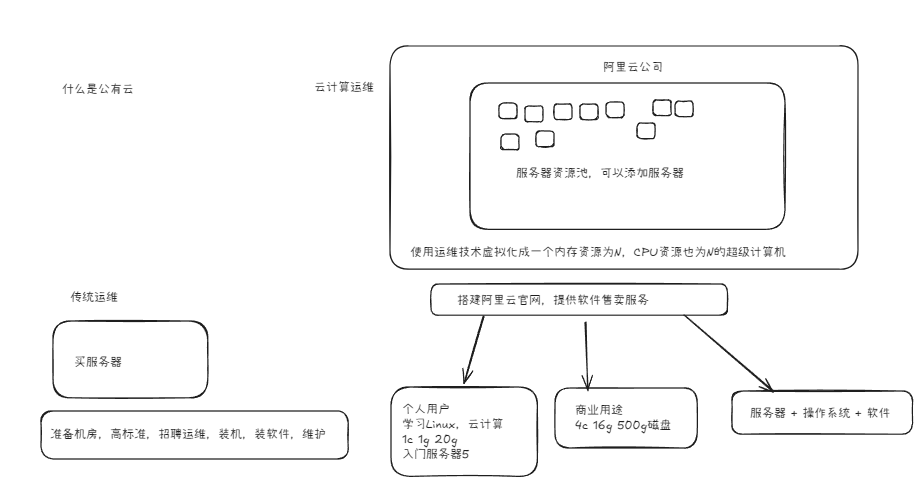
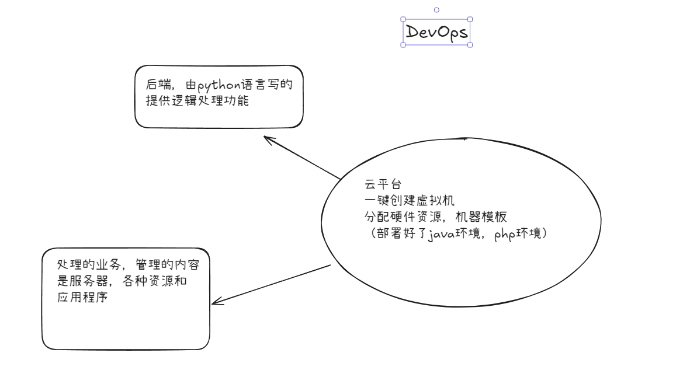
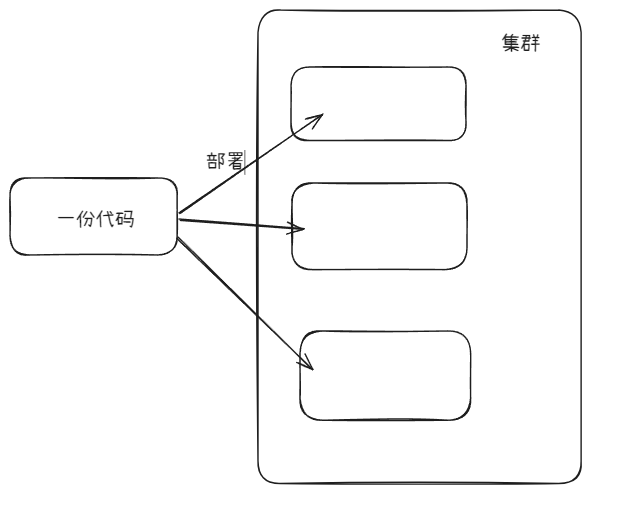
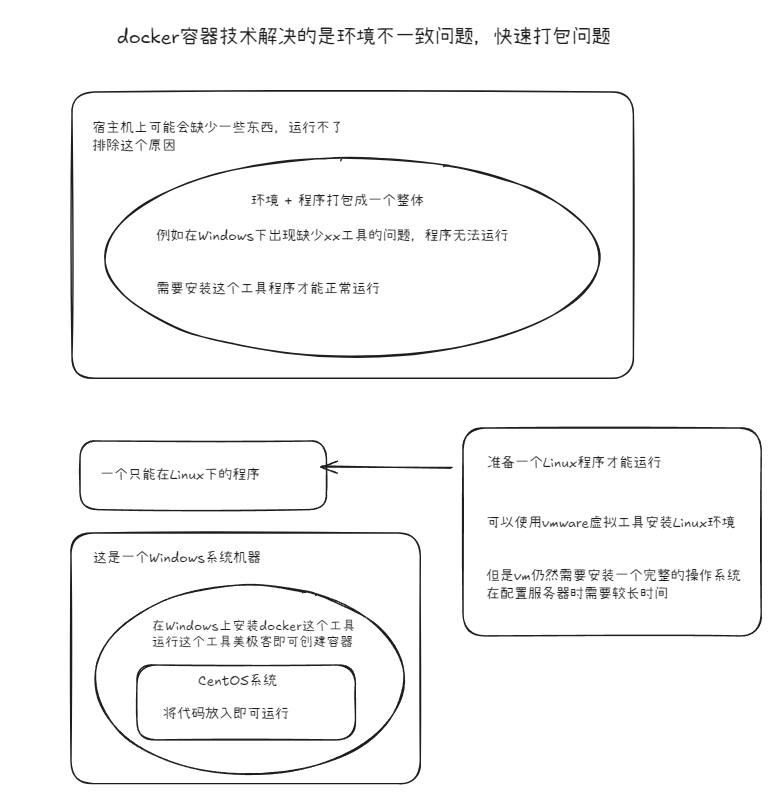
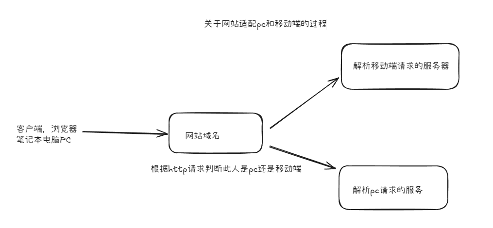
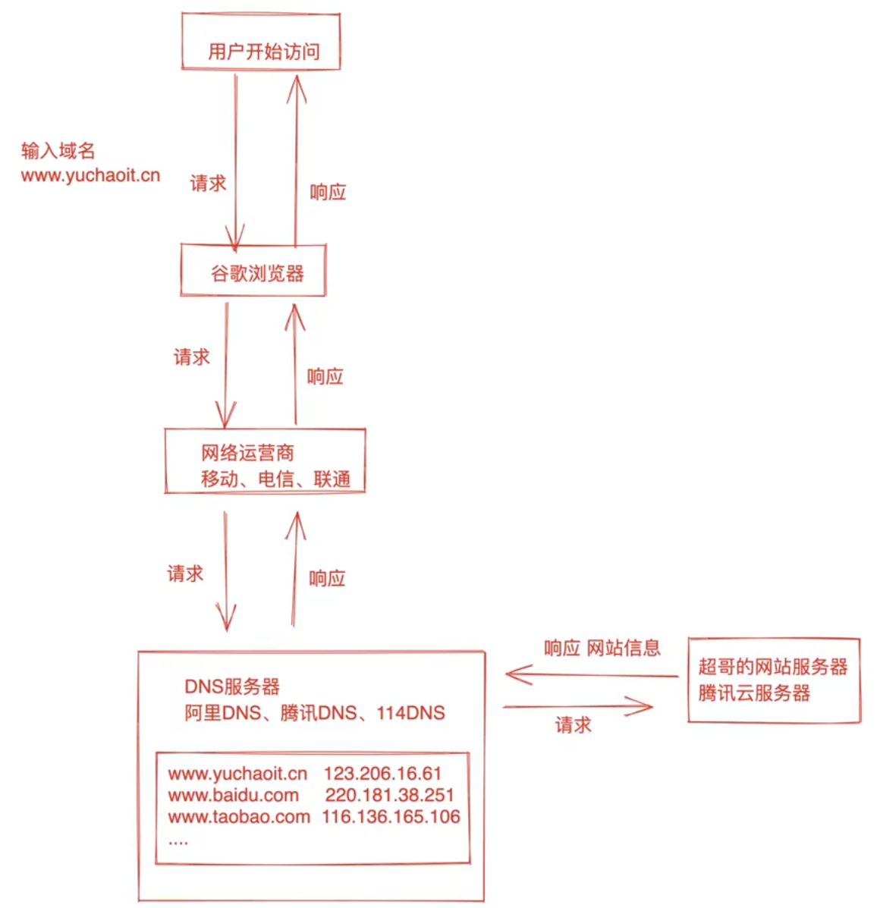

# 运维基本知识

互联网运维通常属于技术部门，与**研发，测试，系统管理**同为互联网产品技术支撑的4大部门

本质上是对网络，服务器（简单维护），应用程序的生命周期各个阶段的运营与维护，在成本，稳定性，效率上达成一致的可接受状态

例如：服务器崩溃时的重启，代码更新后的重新配置

> 以游戏为例：
>
> 网页游戏（browser / server 浏览器/ 服务器模式）
> 服务端：企业部署了一个游戏网址，企业只需要开发一个服务端
> 客户端：打开浏览器，用户访问网址，对应服务器的ip地址
>
> 客户端游戏——app：
> client / server

## 网页游戏部署步骤

1. 开发游戏源码
2. 本地测试代码
3. 买服务器：可以是实体服务器，或者是云服务器，甚至可以使用vmware的虚拟一个服务器（虚拟出内存，cpu，磁盘等硬件，还需要安装Linux系统）
4. 买域名，有了服务器有了ip地址
5. 上传游戏源码到服务器中
6. 运行代码，用户可以通过浏览器访问

### 实际操作

1. 系统跑起来

2. 代码上传到Linux中（涉及大量的linux命令）

3. 代码解压缩，代码配置文件修改，启动服务

4. 检查应用程序是否运行

  > 例如：使用linux命令`netstat -tnlp`能够查看进程

5. 可以使用虚拟机（vmware）的快照功能，能够保存一个可以访问的服务器

6. 用户端可以访问域名或者ip地址来访问这个服务器`ipconfig`

	> 通过机器的ip+端口即可访问一个功能，不同的端口访问不同的功能

## 在线课件部署技术

把文件资料放在linux上，放在服务器上（也可是Windows）通过文件展示的功能，让客户端可以访问
通过ngnix来部署网站，而以淘宝为首的大并发量网站还会使用Tengine

## Linux运维人员的核心职责

- 网站数据不能丢失

- 网站7*24小时运转（通过监控手段，人工运维，微信通知和短信通知等）

- 提升用户体验，访问速度

	 

## Linux行业情况

Linux主要用在企业端，专业的Linux使用

手机系统重Android也基于Linux系统开发

Linux为开源的，多大为开源软件，安全问题很少（遇到病毒直接杀死进程），软件基本是Linux后台

## Linux相关名词解释

### 云计算

云计算 = 公有云（阿里，华为，腾讯云）+ 私有云（openStack） + 混合云

即：运算在云端

公有云：比如一个程序计算任务，会放在阿里云的服务器上，进行计算，得到结果，这样企业就不需要另外准备服务器

服务器是由云服务厂商提供的性能卓越，稳定可靠且弹性拓展的云计算服务

云服务器买免去了采购IT硬件的前期准备，企业能够想使用公共资源一样高效使用服务器，实现计算资源的即开即用和弹性伸缩

## DevOps运维开发工程师

**DevOps** 是一组过程，方法与系统的统称，主要用于促进开发和运营保证团队之间的协同与沟通，从而提高应用程序和服务的交付响应速度
6运维：4开发（python  / go）

## AIOps

智能运维技术，用于解决因IT故障导致的业务中断，结合了大数据和机器学习宣发，减少了人力成本，推动运维自动化

## CI/CD

**CI/CD** 是一种通过在应用开发阶段引入自动化来频繁向客户交付应用的方法

CI/CD 的核心是持续集成，持续交付和持续部署

作为一个面向开发和运营团队的解决方案，CI/CD主要针对在集成新代码时所引发的问题

## Docker

Docker 是一个开源的应用容器引擎，通常包括客户端，守护进程，镜像，容器，让开发者可以打包他们的应用以及依赖包到一个可抑制的镜像中，再发布出去，类似一个集装箱，可以吧货物规整的摆放起来

---

## 运维发展

---

## 互联网工作模式

软件生命周期即系统开发生命周期，是软件的产生到报废的生命周期

整个生命周期包括问题定义与规划，需求分析，系统设计，软件编程，软件测试，软件运维等阶段

> 运维需要知道维护的项目这个产品是如何产生，你又处于哪个环节

---

## 前后端以及网页交互原理

---

## 运维技术栈

- Linux维护基础，指令
- shell自动化
- mysql数据库的维护
- nginx + keepalived + lvs 网站负载均衡，集群搭建（域名的配置等）
- jenkins + git + gitlab + github +jumperserver + vpn 能维护高并发的网址以及保障服务器安全
- mysql + redis + kafaka
- docker + 阿里云计算 + k8s
- 网安的业务运维 + python 运维开发（devops）

---
## 技术部门

